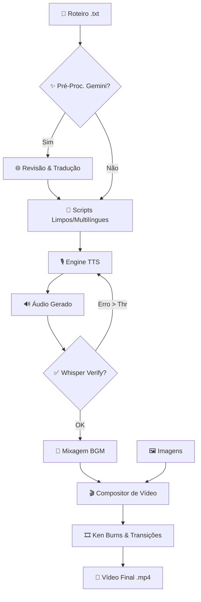

# 🎬 Manhwa Video Creator (V3)

O **Manhwa Video Creator** é uma ferramenta profissional de automação para a criação de vídeos estilo "Manhwa Recap", "Narrativa Visual" e "Audiobooks". Ele combina tecnologias de ponta em **Generative AI (Gemini)**, **TTS (Text-to-Speech)**, **NLP** e **Composição de Vídeo** para transformar roteiros simples em produções de alta qualidade.

---

## 📐 Fluxograma de Processamento

Abaixo, o fluxo lógico desde o roteiro bruto até o vídeo final:

---

## ✨ Funcionalidades Principais

### 1. 📂 Nova Aba de Configurações (🔧)
Agora centralizamos todo o controle do aplicativo em um só lugar:
*   **🔑 Gemini API:** Suporte completo para as famílias **Gemini 3.1**, **Gemini 3.0**, **Gemini 2.5** e as versões experimentais 2.0.
*   **🧠 Nível de Raciocínio (Thinking Level):** Controle granular para os modelos da série 3 (Minimal, Low, Medium, High).
*   **📝 Prompts Customizáveis:** Altere o comportamento da revisão e tradução editando os "System Prompts" diretamente na interface.
*   **🎨 Aparência Dinâmica:** Escolha temas, aplique imagens de fundo personalizadas e ajuste a transparência da UI.
*   **🗑️ Cache Management:** Limpe o cache de processamento do Gemini com um clique.

### 2. 🌐 Pré-processamento Inteligente (Gemini AI)
Transforme roteiros brutos em narrativas fluidas usando raciocínio de última geração:
*   **Revisão Automática:** Remove onomatopeias (BOOM!), limpa símbolos e quebra frases longas.
*   **Tradução Multilíngue:** Gere versões em diversos idiomas mantendo a coesão narrativa.
*   **Suporte Multimodal:** Preparado para processamento de imagens e documentos com controle de resolução de mídia.
*   **Chunking Estratégico:** Processa parágrafos em blocos com sobreposição (overlap) para manter a continuidade.

### 3. 🎙️ Motores de Voz de Alta Fidelidade
*   **Chatterbox (V2):** Clone qualquer voz em segundos (Zero-shot) ou use modelos Turbo/Multilingual.
*   **Kokoro (Local):** Qualidade de estúdio com velocidade impressionante, rodando localmente.

### 4. ✅ Verificação de Qualidade (Whisper)
Interface de segurança que transcreve o áudio gerado e compara com o roteiro. Se o modelo "alucinar" ou errar uma palavra difícil, ele refaz a narração instantaneamente.

### 5. 🎞️ Efeito Ken Burns Automático
Transforma imagens estáticas em cinema através de algoritmos de Zoom e Pan baseados em análise de composição.

---

## 🚀 Instalação e Uso

### Requisitos
*   **Python 3.10+** e **FFmpeg**.
*   **NVIDIA GPU** (8GB+ VRAM) para rodar o TTS local em performance máxima.

### Início Rápido
1. Execute `start.bat` para configurar o ambiente automático.
2. Na aba **🔧 Configurações**, insira sua **Gemini API Key** se desejar usar a revisão inteligente.
3. Na aba **📝 Áudio**, carregue seu `.txt` e use o painel Gemini para limpar o texto.
4. Escolha sua voz na aba **⚙️ TTS**.
5. Adicione imagens na aba **🖼️ Imagens** e gere o vídeo final!

---

## 📄 Tech Stack
*   **Backend:** PyTorch, FFmpeg, SpaCy, Whisper, Google GenAI.
*   **Frontend:** PySide6 (Qt) com suporte a temas modernos.
*   **Aceleração:** Blackwell Optimized (RTX 40/50 Series), BF16/TF32.

---

*Desenvolvido para criadores de conteúdo que buscam velocidade e qualidade profissional.*

