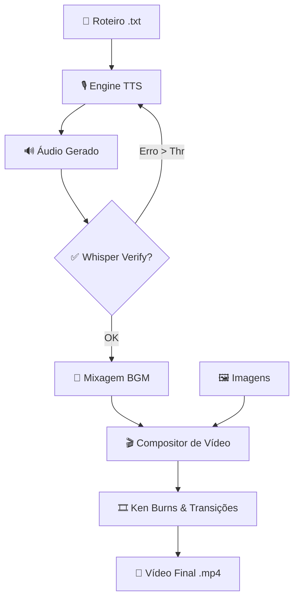

# 🎬 Manhwa Video Creator (V3)

O **Manhwa Video Creator** é uma ferramenta profissional de automação para a criação de vídeos estilo "Manhwa Recap", "Narrativa Visual" e "Audiobooks". Ele foca em um fluxo de trabalho **100% Nativo e Offline**, combinando tecnologias de ponta em **TTS (Text-to-Speech)**, **NLP** e **Composição de Vídeo** para transformar roteiros em produções de alta qualidade sem depender de nuvem.

---

## 📐 Fluxograma de Processamento

Abaixo, o fluxo lógico desde o roteiro bruto até o vídeo final:

---

## ✨ Funcionalidades Principais

### 1. ⛓️ Sistema de Fila (Queue)
Processe múltiplos projetos em sequência de forma automática:
*   **Batch Processing:** Adicione vários roteiros e pastas de imagens para renderização contínua.
*   **Multilíngue:** Suporte para detecção automática de roteiros traduzidos (ex: `roteiro_en.txt`) e geração de áudio em massa.
*   **Reuso de Ativos:** Opção para reutilizar a mesma pasta de imagens entre diferentes tarefas da fila.

### 2. 🎙️ Motores de Voz de Alta Fidelidade
*   **Chatterbox (V2):** Clone qualquer voz em segundos (Zero-shot) ou use modelos Turbo/Multilingual.
*   **Kokoro (Local):** Qualidade de estúdio com velocidade impressionante, rodando 100% localmente.
*   **Qwen & IndexTTS:** Motores adicionais para nichos específicos e suporte a diversos idiomas.

### 3. ✅ Verificação de Qualidade (Whisper)
Interface de segurança que transcreve o áudio gerado e compara com o roteiro original. Se o motor de TTS "alucinar" ou errar uma palavra, o sistema refaz a narração instantaneamente para garantir precisão total.

### 4. 🎞️ Efeito Ken Burns Automático
Transforma imagens estáticas em cinema através de algoritmos de Zoom e Pan dinâmicos, adicionando vida e movimento às cenas de manhwa.

### 5. 🎨 Interface Moderna & Customizável
*   **Temas Premium:** Escolha entre Dark, Light, Amoled e outros esquemas de cores profissionais.
*   **Personalização:** Aplique imagens de fundo com controle de opacidade para criar um ambiente de trabalho agradável.

---

## 🚀 Instalação e Uso

### Requisitos
*   **Python 3.10+** e **FFmpeg**.
*   **NVIDIA GPU** (8GB+ VRAM recomendado) para rodar o TTS local em performance máxima.

### Início Rápido
1. Execute `start.bat` para configurar o ambiente automático.
2. Na aba **⛓️ Fila**, adicione seus projetos informando o arquivo `.txt` e a pasta de imagens correspondente.
3. Configure a voz desejada para cada idioma na aba **🗣️ Traduções Multilíngue**.
4. Clique em **INICIAR PROCESSAMENTO DA FILA** e acompanhe o progresso em tempo real!

---

## 📄 Tech Stack
*   **Backend:** PyTorch, FFmpeg, SpaCy, Whisper (OpenAI).
*   **Frontend:** PySide6 (Qt) com suporte a temas dinâmicos e aceleração de hardware.
*   **Aceleração:** Blackwell Optimized (RTX 40/50 Series), suporte a BF16/TF32.

---

*Desenvolvido para criadores de conteúdo que buscam velocidade e qualidade profissional offline.*

